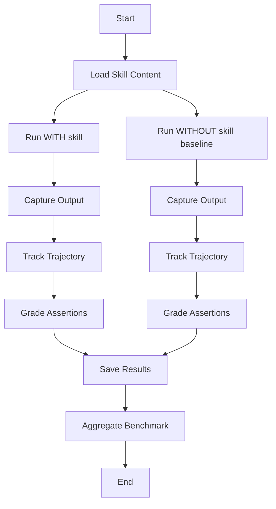

# Skill Evaluation Guide - Deep Agents Methodology

This project uses **Deep Agents-style evaluation** without LangSmith dependency.

## Overview

Automated pytest-based evaluation following Deep Agents methodology:
- **Comparative testing** (with skill vs without skill)
- **Trajectory tracking** (tool calls, execution steps)
- **Automated grading** with assertions
- **Statistical aggregation** of results

---

## Quick Start

### 1. Install Dependencies

```bash
cd template_agent/agent_config
pip install -e ".[test]"
```

This installs:
- `pytest` - Test framework
- `pytest-json-report` - JSON output for results

### 2. Run All Tests

```bash
cd skills
./run_evals.sh
```

### 3. View Results

```bash
cat ../workspaces/bmi-report-workspace/iteration-1/benchmark.json
```

---

## How It Works

### Test Structure

```
skills/
├── tests/
│   ├── conftest.py              # Pytest configuration & fixtures
│   ├── test_bmi_report.py       # Tests for bmi-report skill
│   ├── test_client_intake.py   # Tests for client-intake skill
│   ├── test_email_formatter.py # Tests for email-formatter skill
│   └── aggregate_results.py    # Results aggregation
├── pytest.ini                   # Pytest settings
└── run_evals.sh                 # Test runner script
```

### Test Execution Flow



### Captured Data

For each test:
- **outputs/** - Generated files
- **trajectory.json** - Execution trace (tool calls, steps)
- **timing.json** - Tokens and duration
- **grading.json** - Assertion results

---

## Running Tests

### All Tests

```bash
./run_evals.sh
```

### Specific Skill

```bash
./run_evals.sh --skill bmi-report
```

### Only Baseline Tests

```bash
./run_evals.sh --baseline-only
```

### Only Skill Tests

```bash
./run_evals.sh --skill-only
```

### With Pytest Directly

```bash
# All tests
pytest tests/

# Specific skill
pytest tests/test_bmi_report.py

# With markers
pytest -m skill          # Only with_skill tests
pytest -m baseline       # Only without_skill tests
pytest -m slow           # Slow comparison tests

# Verbose output
pytest -vv tests/

# Show print statements
pytest -s tests/
```

---

## Test Structure

### Each Test Case

```python
@pytest.mark.skill
def test_eval_1_with_skill(self, tracer, evaluator):
    """Test eval-1 with skill loaded."""
    # 1. Load skill content
    # 2. Execute task with skill
    # 3. Capture trajectory
    # 4. Grade assertions
    # 5. Save results
```

### Fixtures

- **tracer** - `ExecutionTracer` for capturing agent behavior
- **evaluator** - `AssertionEvaluator` for grading outputs
- **skills_dir** - Path to skills directory
- **workspace_dir** - Path to workspaces

### Trajectory Tracking

The `ExecutionTracer` captures:

```python
tracer.start()
tracer.add_step("load_skill", "Loaded SKILL.md")
tracer.add_tool_call("read_file", {"path": "..."}, result)
tracer.add_step("execute", "Running task...")
tracer.end()

trajectory = tracer.get_trajectory()
# {
#   "steps": [...],
#   "tool_calls": [...],
#   "duration_ms": 1234,
#   "total_steps": 5,
#   "total_tool_calls": 3
# }
```

---

## Assertion Grading

### Automatic vs Manual

The `AssertionEvaluator` attempts automatic grading for simple assertions:

```python
# Automatic grading (string matching)
"Report includes BMI value 22.5" → checks if "22.5" in output

# Manual grading required
"Tone is friendly and encouraging" → needs human or LLM review
```

### Grading Output

```json
{
  "assertion_results": [
    {
      "text": "Report includes BMI value 22.5",
      "passed": true,
      "evidence": "Found '22.5' in output",
      "confidence": 0.9
    }
  ],
  "summary": {
    "passed": 6,
    "failed": 0,
    "total": 6,
    "pass_rate": 1.0
  }
}
```

---

## Results Aggregation

After all tests complete:

```bash
python3 tests/aggregate_results.py
```

Generates `benchmark.json`:

```json
{
  "run_summary": {
    "with_skill": {
      "pass_rate": {"mean": 0.85, "stddev": 0.08},
      "time_seconds": {"mean": 12.5, "stddev": 3.2},
      "tokens": {"mean": 2800, "stddev": 450},
      "tool_calls": {"mean": 4.2, "stddev": 1.1},
      "steps": {"mean": 8.5, "stddev": 2.3}
    },
    "without_skill": {
      "pass_rate": {"mean": 0.42, "stddev": 0.15},
      "time_seconds": {"mean": 8.3, "stddev": 2.1},
      "tokens": {"mean": 1900, "stddev": 320},
      "tool_calls": {"mean": 2.1, "stddev": 0.8},
      "steps": {"mean": 5.2, "stddev": 1.5}
    },
    "delta": {
      "pass_rate": 0.43,
      "time_seconds": 4.2,
      "tokens": 900,
      "tool_calls": 2.1,
      "steps": 3.3
    }
  }
}
```

---

## Adding New Skills

### 1. Create Test File

```python
# tests/test_new_skill.py
from conftest import load_skill_evals, ExecutionTracer

class TestNewSkill:
    @pytest.fixture(autouse=True)
    def setup(self, skills_dir, workspace_dir):
        self.skill_name = "new-skill"
        self.skill_path = skills_dir / self.skill_name
        self.evals_data = load_skill_evals(self.skill_name)
        self.workspace = workspace_dir / f"{self.skill_name}-workspace" / "iteration-1"
        self.workspace.mkdir(parents=True, exist_ok=True)

    @pytest.mark.skill
    def test_eval_1_with_skill(self, tracer, evaluator):
        # Test implementation
        pass
```

### 2. Create evals.json

```json
{
  "skill_name": "new-skill",
  "evals": [
    {
      "id": 1,
      "prompt": "Test prompt",
      "expected_output": "Expected result",
      "files": [],
      "assertions": [
        "Assertion 1",
        "Assertion 2"
      ]
    }
  ]
}
```

### 3. Run Tests

```bash
./run_evals.sh --skill new-skill
```

---

## Integration with Agent

### Current State

Tests use **placeholder outputs** (see `_mock_output_with_skill()` in test files).

### To Integrate Real Agent

Replace mock functions with actual agent calls:

```python
def run_eval_with_skill(self, eval_id: int, tracer: ExecutionTracer) -> dict:
    tracer.start()

    # Load skill
    skill_content = load_skill_content(self.skill_path)

    # REPLACE THIS with your agent:
    # from your_agent import Agent
    # agent = Agent(skills=[skill_content])
    # output = agent.run(eval_case['prompt'])

    # For now, using mock:
    output = self._mock_output_with_skill(eval_case)

    tracer.end()
    return {"output": output, "trajectory": tracer.get_trajectory()}
```

---

## Deep Agents Comparison

### What We Adopted ✅

- ✅ pytest-based automation
- ✅ Trajectory tracking (tool calls, steps)
- ✅ Comparative evaluation (with vs without)
- ✅ Statistical aggregation
- ✅ Clean test isolation

### What We Skipped ⏭️

- ⏭️ LangSmith integration (requires external service)
- ⏭️ Docker containers (optional, can add later)
- ⏭️ Deep Agents CLI dependency

### What's Different

| Aspect | Deep Agents | Our Implementation |
|--------|-------------|-------------------|
| LLM Integration | LangChain/LangGraph | Framework-agnostic |
| Observability | LangSmith | Local JSON files |
| Isolation | Docker | Workspace directories |
| Dependencies | Heavy | Minimal (just pytest) |

---

## Best Practices

### From Deep Agents Research

1. **~12 skills optimal** - More causes confusion
2. **Constrained tasks** - Bug fixing > open-ended
3. **Clean environments** - Fresh context per test
4. **Real failures** - Not adversarial scenarios
5. **Strategic placement** - AGENTS.md, CLAUDE.md for reliability

### Our Additions

1. **Placeholder pattern** - Easy to swap in real agent
2. **JSON-based results** - Easy to inspect and debug
3. **Minimal dependencies** - Runs anywhere
4. **Clear separation** - Tests don't modify skills

---

## Troubleshooting

### pytest not found

```bash
pip install pytest
```

### Tests fail to find skills

Check paths in conftest.py - they're relative to test file location.

### No results aggregated

Ensure tests completed successfully first:

```bash
pytest tests/ -v
```

Then aggregate:

```bash
python3 tests/aggregate_results.py
```

### Grading shows None

Some assertions require manual evaluation. Update grading.json manually or enhance the evaluator.

---

## Next Steps

1. **Integrate real agent** - Replace mock functions
2. **Enhance evaluator** - Use LLM for complex assertions
3. **Add Docker** (optional) - For reproducibility
4. **CI/CD integration** - Run tests automatically
5. **Iteration-2** - Improve skills based on results

---

## References

- [Deep Agents Evaluation Blog](https://blog.langchain.com/evaluating-skills/)
- [Deep Agents Skills Documentation](https://docs.langchain.com/oss/python/deepagents/skills)
- [agentskills.io Specification](https://agentskills.io/specification)
- [agentskills.io Evaluation Guide](https://agentskills.io/skill-creation/evaluating-skills)
