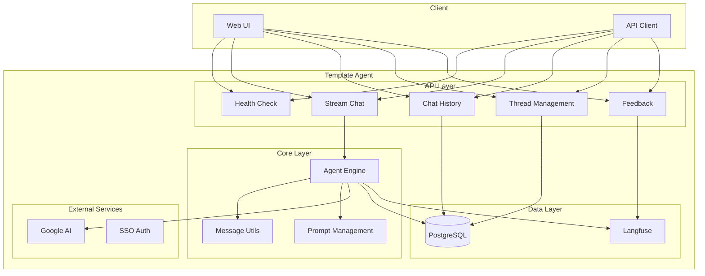

# Template Agent

[](https://www.python.org/downloads/)
[](https://github.com/redhat-data-and-ai/template-mcp-server/actions/workflows/ci.yml)
[](https://codecov.io/gh/redhat-data-and-ai/template-mcp-server)
[](https://opensource.org/licenses/Apache-2.0)

A production-ready template for building AI agents with streaming capabilities, conversation management, and enterprise-grade features.

## 🌟 Features

- **Simplified Streaming API**: Clean, consistent event format for easy client integration
- **Real-time Streaming**: Server-Sent Events (SSE) with token and message streaming
- **Multiple Client Examples**: TypeScript, Python async, and Streamlit demo applications
- **Conversation Management**: Multi-turn conversations with thread persistence
- **Enterprise Integration**: Langfuse tracing, PostgreSQL checkpointing, SSO support
- **Modular Architecture**: AgentManager abstraction with clean separation of concerns
- **Production Ready**: Health checks, error handling, and comprehensive logging
- **Google AI Integration**: Built-in support for Google Generative AI models

## 🏗️ Architecture



## 📡 Simplified Streaming API

The Template Agent now features a simplified streaming API that makes client integration easier while preserving all enterprise features:

### Single Streaming Endpoint

```http
POST /v1/stream
Content-Type: application/json
Accept: text/event-stream
```

### Request Format

```json
{
  "message": "User input message",
  "thread_id": "conversation-thread-id",
  "session_id": "session-id",
  "user_id": "user-identifier",
  "stream_tokens": true
}
```

### Response Format

```json
{"type": "message", "content": {"type": "ai", "content": "", "tool_calls": [...]}}
{"type": "token", "content": "Hello"}
{"type": "token", "content": " world"}
{"type": "message", "content": {"type": "ai", "content": "Hello world"}}
[DONE]
```

### Client Examples

Ready-to-use client examples are available in the [`examples/`](./examples/) directory:

- **[Streamlit Demo App](./examples/streamlit_app.py)** - Interactive chat application
- **[Python Async Client](./examples/client_python.py)** - Server-to-server integration

See the [examples README](./examples/README.md) for detailed usage instructions.

## 🚀 Quick Start

### Prerequisites

- Python 3.12+
- PostgreSQL database
- Google AI API credentials
- Langfuse account (optional)

### Installation

1. **Clone the repository**
   ```bash
   git clone https://github.com/redhat-data-and-ai/template-agent.git
   cd template-agent
   ```

2. **Create virtual environment**
   ```bash
   uv venv
   source .venv/bin/activate

   ```

3. **Install dependencies**
   ```bash
   uv pip install -e ".[dev]"
   ```

4. **Set up environment variables**
   ```bash
   cp .env.example .env
   # Edit .env with your configuration
   ```

5. **Run template-mcp-server** following https://github.com/redhat-data-and-ai/template-mcp-server


6. **Run the application**
   ```bash
   uv run python -m template_agent.src.main
   ```


## 📚 API Reference

### Endpoints

| Endpoint                  | Method | Description |
|---------------------------|--------|-------------|
| `/health`                 | GET | Health check |
| `/v1/stream`              | POST | Stream chat responses |
| `/v1/history/{thread_id}` | GET | Get conversation history |
| `/v1/threads/{user_id}`   | GET | List user threads |
| `/v1/feedback`            | POST | Record feedback |

### Streaming Chat

```bash
curl -X POST "http://localhost:8081/v1/stream" \
  -H "Content-Type: application/json" \
  -d '{
    "message": "Hello, how can you help me?",
    "thread_id": "thread_123",
    "user_id": "user_456",
    "stream_tokens": true
  }'
```

### Health Check

```bash
curl "http://localhost:8081/health"
# Response: {"status": "healthy", "service": "Template Agent"}
```

## ⚙️ Configuration

### Environment Variables

#### Required
- `AGENT_HOST`: Server host (default: 0.0.0.0)
- `AGENT_PORT`: Server port (default: 5002)
- `PYTHON_LOG_LEVEL`: Logging level (default: INFO)

#### Database
- `POSTGRES_USER`: Database username (default: pgvector)
- `POSTGRES_PASSWORD`: Database password (default: pgvector)
- `POSTGRES_DB`: Database name (default: pgvector)
- `POSTGRES_HOST`: Database host (default: pgvector)
- `POSTGRES_PORT`: Database port (default: 5432)

#### Optional
- `LANGFUSE_PUBLIC_KEY`: Langfuse public key for tracing
- `LANGFUSE_SECRET_KEY`: Langfuse secret key for tracing
- `LANGFUSE_BASE_URL`: Langfuse host URL (e.g., https://cloud.langfuse.com)
- `LANGFUSE_TRACING_ENVIRONMENT`: Langfuse environment (default: development)
- `GOOGLE_SERVICE_ACCOUNT_FILE`: Google credentials
- `AGENT_SSL_KEYFILE`: SSL private key path
- `AGENT_SSL_CERTFILE`: SSL certificate path

### Configuration Example

```bash
# .env file
AGENT_HOST=0.0.0.0
AGENT_PORT=5002
PYTHON_LOG_LEVEL=INFO

POSTGRES_USER=myuser
POSTGRES_PASSWORD=mypassword
POSTGRES_DB=template_agent
POSTGRES_HOST=localhost
POSTGRES_PORT=5432

LANGFUSE_TRACING_ENVIRONMENT=production
GOOGLE_SERVICE_ACCOUNT_FILE=/path/to/credentials.json
```

## 🧪 Testing

### Run Tests

```bash
# Run all tests
pytest

# Run with coverage
pytest --cov=template_agent.src --cov-report=html

# Run specific test file
pytest tests/test_prompt.py -v
```

### Test Coverage

Current test coverage includes:
- ✅ Core utilities (prompt, agent_utils)
- ✅ Data models (schema)
- ✅ Configuration (settings)
- ✅ API endpoints (health, feedback)
- 🔄 Complex routes (history, stream, threads)
- 🔄 Application setup (api, main, agent)

## 🚀 Deployment

### Podman Compose

```bash
# Start with Docker Compose
podman-compose up -d --build
```

### Production Considerations

- **SSL/TLS**: Configure SSL certificates for HTTPS
- **Database**: Use managed PostgreSQL service
- **Monitoring**: Set up Langfuse for tracing
- **Scaling**: Configure horizontal pod autoscaling
- **Security**: Implement proper authentication

## 🔧 Development

### Project Structure

```
template-agent/
├── template_agent/
│   └── src/
│       ├── core/           # Core agent functionality
│       │   ├── agent.py    # Agent initialization
│       │   ├── agent_utils.py  # Message utilities
│       │   └── prompt.py   # Prompt management
│       ├── routes/         # API endpoints
│       │   ├── health.py   # Health checks
│       │   ├── stream.py   # Streaming chat
│       │   ├── history.py  # Chat history
│       │   ├── threads.py  # Thread management
│       │   └── feedback.py # Feedback recording
│       ├── api.py          # FastAPI application
│       ├── main.py         # Application entry point
│       ├── schema.py       # Data models
│       └── settings.py     # Configuration
├── tests/                  # Test suite
└── README.md              # This file
```

### Code Quality

```bash
# Run linting
ruff check .

# Run type checking
mypy template_agent/src/

# Run formatting
ruff format .

# Run pre-commit hooks
pre-commit run --all-files
```

### Adding New Features

1. **Create feature branch**
   ```bash
   git checkout -b feature/new-feature
   ```

2. **Implement changes**
   - Follow Google docstring format
   - Add type hints
   - Write tests for new functionality

3. **Run quality checks**
   ```bash
   pre-commit run --all-files
   pytest
   ```

4. **Submit pull request**
   - Include tests
   - Update documentation
   - Follow commit message conventions

### Development Setup

1. Fork the repository
2. Create a feature branch
3. Make your changes
4. Add tests for new functionality
5. Ensure all tests pass
6. Submit a pull request

### Code Standards

- **Python**: Follow PEP 8 and use type hints
- **Documentation**: Use Google docstring format
- **Tests**: Maintain >80% code coverage
- **Commits**: Use conventional commit messages

This template includes `.cursor/rules.md` - a comprehensive development guide specifically designed to help AI coding assistants understand and work effectively with this MCP server template.

### What's Included

## 🆘 Support

- **Issues**: [GitHub Issues](https://github.com/redhat-data-and-ai/template-agent/issues)

## 🔗 Related Projects

- [LangChain](https://github.com/langchain-ai/langchain) - LLM application framework
- [LangGraph](https://github.com/langchain-ai/langgraph) - Stateful LLM applications
- [FastAPI](https://fastapi.tiangolo.com/) - Modern web framework
- [Langfuse](https://langfuse.com/) - LLM observability platform

---

**Built with ❤️ by the Red Hat Data & AI team**
