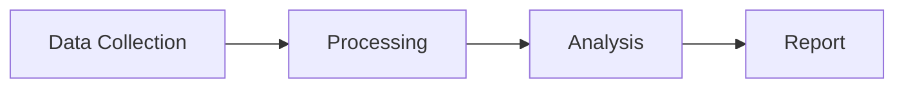

# Research Report Template

## Report Structure

### 1. Title
Format: `# [Topic]: Comprehensive Analysis`

### 2. Executive Summary
- 3-5 sentences capturing the most important findings
- Written for someone who will only read this section
- Include the single most surprising or important finding

### 3. Table of Contents
- List all major sections with numbering
- Helps readers navigate long reports

### 4. Main Sections
- Organize by theme, not by sub-question (synthesize, don't just concatenate)
- Each section should flow logically into the next
- Use H2 (`##`) for major sections, H3 (`###`) for subsections
- Include inline citations: ([Source Title](url))

### 5. Key Takeaways
- 3-7 bullet points
- Actionable insights, not just facts
- Ordered by importance

### 6. Sources
- Numbered list of all sources cited
- Format: `1. [Title](URL) — [one-line description]`

## Writing Guidelines

### Tone
- Clear, objective, professional
- Present facts first, then analysis
- Avoid hedging language ("it seems", "perhaps") — be direct

### Handling Disagreements
When sources conflict, present both sides:
> While [Source A] reports that X, [Source B] found the opposite — suggesting that this remains an open question.

### Comparisons
Use markdown tables for structured comparisons:

```markdown
| Feature | Option A | Option B |
|---------|----------|----------|
| Performance | Fast | Moderate |
| Cost | High | Low |
```

### Mermaid Diagrams
Include a Mermaid diagram when the topic involves:
- **Processes**: flowchart showing steps or decision trees
- **Architectures**: system components and their relationships
- **Timelines**: sequence of events or evolution

Example:
````markdown

````

### Length Guidelines
- SIMPLE topics: 500-1000 words
- MODERATE topics: 1000-2000 words
- COMPLEX topics: 2000-4000 words
- Never pad for length — be concise and substantive
